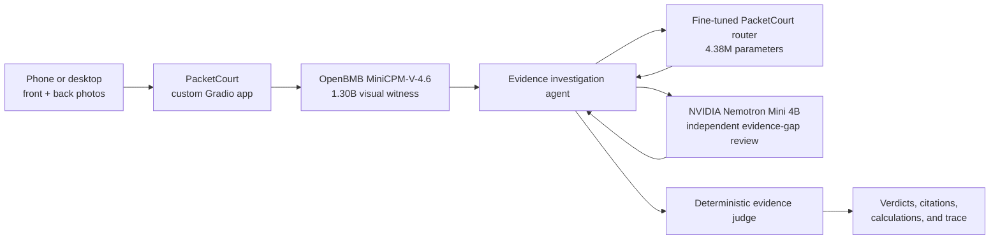

# PacketCourt: The packet takes the stand

Food packets are unusually good at telling two different stories at once.

The front has seconds to persuade: **HIGH PROTEIN**, **MULTIGRAIN**, **100%
NATURAL**, **BAKED NOT FRIED**. The back carries the evidence needed to
interpret those claims: ingredient order, nutrition basis, package size,
licensing text, dates, and instructions that only matter after opening.

PacketCourt is my attempt to make those two surfaces answer to each other.

It is a phone-first Gradio app for Indian packaged-food labels. A user
photographs the front and back of a packet. PacketCourt reads the visible text,
plans an evidence investigation, performs deterministic calculations, and
returns conservative verdicts with citations.

It does not produce a health score. It asks a narrower question:

> Does the evidence printed on this packet support the impression created by
> its front?

Try the Space: https://huggingface.co/spaces/build-small-hackathon/packetcourt

Read the Codex-attributed source:
https://github.com/N-45div/PacketCourt

## The product decision that shaped everything

An early version of the idea was a general nutrition scanner. That direction
was broad, crowded, and difficult to trust. A single red, yellow, or green score
would hide too many judgments:

- Is sugar always worse than protein is good?
- How should serving size affect a score?
- Does an FSSAI license imply a health endorsement?
- Can OCR uncertainty silently change the answer?

PacketCourt therefore avoids ranking products. It audits claims against
evidence from the same supplied packet.

The output language is intentionally constrained:

- `SUPPORTED BY PROVIDED LABEL`
- `CONTRADICTED BY PROVIDED LABEL`
- `TECHNICALLY TRUE, CONTEXT MISSING`
- `CANNOT VERIFY`

The phrase **provided label** matters. PacketCourt does not pretend that a
photograph is a laboratory analysis or that a missing line of text does not
exist.

## A three-model investigation with a deterministic judge

PacketCourt uses small models where interpretation is useful and deterministic
code where exactness is required.

### OpenBMB MiniCPM-V-4.6: the visual witness

The vision companion runs privately on ZeroGPU. It receives a packet image and
transcribes only visibly printed evidence. The front prompt focuses on claims.
The back prompt focuses on ingredients, nutrition values and basis, net weight,
FSSAI license text, dates, and after-opening instructions.

The model is asked not to explain or infer. Its responsibility is to surface
what is visible for the next stage.

### A fine-tuned 4.38M-parameter evidence router

Different claims require different evidence.

- `NO ADDED SUGAR` requires ingredient inspection.
- `HIGH PROTEIN` requires nutrition values and their measurement basis.
- `FSSAI APPROVED` requires license evidence and a registration-versus-
  endorsement distinction.
- `100% NATURAL` requires the safety boundary because the absolute claim cannot
  be established from packet text alone.

I fine-tuned a tiny BERT classifier to route claims to five bounded tools:
`ingredients`, `nutrition`, `license`, `dates`, and `refuse_absolute`.

The first training run reached only `0.40` held-out accuracy. The random split
did not preserve every routing class, and the dataset was too thin. I did not
enable that checkpoint.

After balancing the claim variants and using a stratified five-class holdout,
the corrected checkpoint reached `1.000` on the small held-out set. That result
is useful evidence that the routing task is learnable, not proof of broad
generalization. Deterministic policy fallback remains available when the model
cannot load.

Model: https://huggingface.co/build-small-hackathon/packetcourt-evidence-router

Training data:
https://huggingface.co/datasets/build-small-hackathon/packetcourt-router-training

### NVIDIA Nemotron: an independent reviewer, not the judge

After the investigation plan completes, NVIDIA
`Nemotron-Mini-4B-Instruct` reviews the structured case for missing evidence.
It can identify the highest-priority next action or confirm that the bounded
investigation is complete.

It cannot change a verdict.

This separation matters. A language model is useful for reviewing whether the
investigation overlooked an evidence gap. It should not silently override
arithmetic or invent a regulatory conclusion.

The first Nemotron deployment also failed. I initially used
`NVIDIA-Nemotron-3-Nano-4B-BF16`, but a real ZeroGPU probe exposed a dependency
on a specialized Mamba CUDA runtime unavailable in the standard Gradio image.
I switched to Nemotron Mini 4B only after the replacement completed a real
ZeroGPU review.

## The deterministic evidence judge

The final verdict path is ordinary Python.

That code:

- detects known front claims;
- extracts ingredients;
- parses nutrition values and their declared basis;
- calculates whole-packet protein, sugar, sodium, and saturated fat;
- converts total sugar into a teaspoon equivalent;
- resolves direct and relative best-before dates;
- extracts after-opening deadlines;
- applies conservative claim-specific verdict rules.

For example, when a nutrition panel declares values per `100g` and the packet
contains `300g`, PacketCourt scales the values by exactly `3`. It does not ask a
language model to perform that arithmetic.

## Persuasion Gap

Claim verification alone did not capture the most interesting part of the
problem.

A `HIGH PROTEIN` claim can be supported by visible protein evidence while the
complete packet also contains substantial sugar or sodium. A multigrain claim
can be technically true while refined flour remains the first ingredient.

PacketCourt therefore calculates a **Persuasion Gap**: material context on the
back that competes with the impression emphasized on the front.

Examples include:

- “Protein leads. Whole-packet sugar stays quiet.”
- “A positive front claim competes with substantial sodium.”
- “Grain variety is prominent. The first ingredient is refined.”
- “Registration language can look like a health endorsement.”

Each finding cites the exact evidence or calculation. PacketCourt still leaves
the final decision with the user.

## What makes the agent bounded

For every packet, PacketCourt emits an explicit investigation record:

- objective;
- selected evidence tools;
- reason each tool was selected;
- whether the fine-tuned router or policy fallback selected it;
- missing-evidence requests;
- stop reason;
- independent Nemotron review;
- deterministic verdicts and limitations.

There are only two valid stopping conditions:

1. every evidence tool required by the detected claims completed; or
2. required evidence is missing, so PacketCourt stops and asks for it.

The public trace dataset contains no hidden chain-of-thought. It exposes tool
decisions, evidence outputs, calculations, and boundaries suitable for
inspection.

Traces:
https://huggingface.co/datasets/build-small-hackathon/packetcourt-traces

## Evaluation

The current release has:

- `9` passing unit tests;
- `35/35` passing checks across `10` golden packet cases;
- `10` transparent investigation traces;
- one published real end-to-end Nemotron review trace;
- a successful live audit using the fine-tuned router and Nemotron reviewer.

The golden cases cover contradictions, supported claims, missing context,
whole-packet calculations, refined-grain context, FSSAI registration language,
relative shelf-life arithmetic, and after-opening instructions.

Golden cases:
https://huggingface.co/datasets/build-small-hackathon/packetcourt-golden-cases

## The interface is part of the evidence standard

PacketCourt uses a custom responsive frontend mounted over a Gradio engine.
The phone workflow matters because the packet is physically in the user's
hand. The results view shows the investigation path before the verdict cards,
then separates persuasion gaps, claim findings, nutrition calculations, date
evidence, and machine-readable JSON.

Uncertainty is not hidden in a tooltip. It is part of the primary result.

## What PacketCourt refuses to claim

PacketCourt does not declare a food:

- healthy;
- safe;
- illegal;
- fraudulent;
- suitable for a medical condition.

It audits only supplied packet evidence. OCR should be checked against the
physical label. `CANNOT VERIFY` is a successful outcome when the evidence is
insufficient.

That refusal is not a missing feature. It is PacketCourt's standard of proof.

## Built small

The complete model budget is approximately `5.3B` parameters:

- OpenBMB MiniCPM-V-4.6: `1.30B`;
- NVIDIA Nemotron Mini: approximately `4B`;
- fine-tuned PacketCourt router: `4.38M`.

The main evidence judge remains deterministic and CPU-based. ZeroGPU is
requested only for visual transcription and the independent Nemotron review.

PacketCourt was built with OpenAI Codex as the primary coding agent. The public
GitHub repository preserves Codex-attributed commits covering the architecture,
tests, fine-tuning workflow, model companions, trace publication, UI, and
deployment.

Space: https://huggingface.co/spaces/build-small-hackathon/packetcourt

GitHub: https://github.com/N-45div/PacketCourt

Model: https://huggingface.co/build-small-hackathon/packetcourt-evidence-router

Traces: https://huggingface.co/datasets/build-small-hackathon/packetcourt-traces
