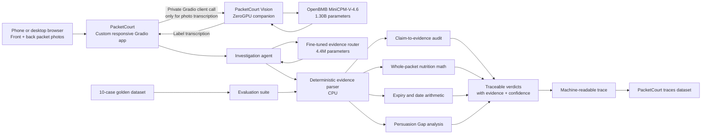

# PacketCourt

**The packet takes the stand.**

PacketCourt audits front-of-pack marketing claims against evidence printed on
the same Indian packaged-food label. It produces traceable, conservative
verdicts instead of an unexplained health score.

## Why PacketCourt

A packet may lead with `HIGH PROTEIN`, `MULTIGRAIN`, or `100% NATURAL` while
the material context sits elsewhere in small print. PacketCourt does not assign
a mysterious health score. It asks a narrower, auditable question:

> Does the evidence printed on this packet support the impression created by
> its front?

Every finding cites supplied label evidence, shows uncertainty, and can be
inspected as structured JSON.

## Live Architecture



Photo transcription uses the 1.30B-parameter OpenBMB `MiniCPM-V-4.6` through
a private ZeroGPU companion. A fine-tuned 4.4M-parameter evidence router
selects the investigation tools required by each claim. The main CPU Space
performs deterministic evidence auditing, whole-packet calculations,
persuasion-gap analysis, and refusals. ZeroGPU is requested only while reading
photos.

## What It Audits

PacketCourt currently recognizes and audits:

- `High Protein`
- `No Added Sugar`
- `Multigrain`
- `100% Natural`
- `FSSAI Approved`
- `No Preservatives`
- `Baked Not Fried`
- `Zero Trans Fat`
- `Whole Grain`

The engine links those claims to ingredients, nutrition values, licensing
text, package size, and date evidence. It also:

- calculates whole-packet protein, sugar, sodium, and sugar-teaspoon equivalent;
- resolves relative dates such as `best before 6 months from packaging`;
- surfaces after-opening instructions;
- identifies material context omitted from the front through the
  **Persuasion Gap**;
- returns a machine-readable evidence case for every audit.

## Verdict Standard

PacketCourt uses four deliberately conservative verdicts:

| Verdict | Meaning |
|---|---|
| `SUPPORTED BY PROVIDED LABEL` | The supplied back label provides direct evidence. |
| `CONTRADICTED BY PROVIDED LABEL` | The supplied evidence conflicts with the front claim. |
| `TECHNICALLY TRUE, CONTEXT MISSING` | The claim may be true, but material context is quiet. |
| `CANNOT VERIFY` | The packet has not supplied enough evidence. |

## Product Surface

- Phone-friendly front and back photo capture
- OpenBMB small-model label transcription with Tesseract fallback
- Paste-text workflow for difficult or damaged labels
- Prepared cases for an immediate product walkthrough
- Fully custom responsive interface backed by a mounted Gradio engine
- Evidence citations, confidence, and transparent structured output

## Run Locally

```bash
python -m pip install -r requirements.txt
python app.py
```

## Test

```bash
pytest
python scripts/evaluate.py
python scripts/export_traces.py
```

Current deterministic evaluation result:

- `9` unit tests passing
- `35/35` golden-case checks passing across `10` cases
- `10` transparent traces exported
- `1.000` held-out accuracy on the stratified evidence-router evaluation

## Live Assets

- Main private product: https://huggingface.co/spaces/build-small-hackathon/packetcourt
- Private OpenBMB ZeroGPU vision companion: https://huggingface.co/spaces/build-small-hackathon/packetcourt-vision
- Private golden evaluation dataset: https://huggingface.co/datasets/build-small-hackathon/packetcourt-golden-cases
- Public transparent agent traces: https://huggingface.co/datasets/build-small-hackathon/packetcourt-traces
- Fine-tuned evidence router: https://huggingface.co/build-small-hackathon/packetcourt-evidence-router
- Public router training set: https://huggingface.co/datasets/build-small-hackathon/packetcourt-router-training
- Public Field Notes report: https://huggingface.co/datasets/build-small-hackathon/packetcourt-field-notes

## Safety Boundary

PacketCourt does not declare products healthy, safe, illegal, or fraudulent.
It does not diagnose, replace professional dietary advice, or infer facts that
are absent from the supplied packet. It audits only the provided label evidence
and exposes uncertainty explicitly.

## Codex Attribution

The repository is being built with OpenAI Codex as the primary coding agent.
Codex is responsible for the initial architecture, deterministic audit engine,
tests, custom Gradio application, small-model integration, evaluation pipeline,
and deployment workflow. The git history contains Codex-attributed commits.
