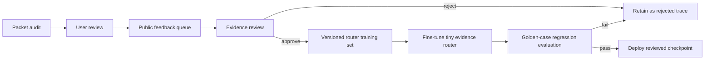

# Community Learning Loop

The loop is deliberately approval-gated. User feedback is valuable evidence,
but it is not automatically true. Every queued correction includes the audit,
investigation trace, and Nemotron review so a reviewer can decide whether it
should become training data.

PacketCourt's deterministic verdict engine and safety boundaries are never
rewritten by public feedback. Nemotron remains an independent reviewer rather
than a model that silently trains on its own outputs.
